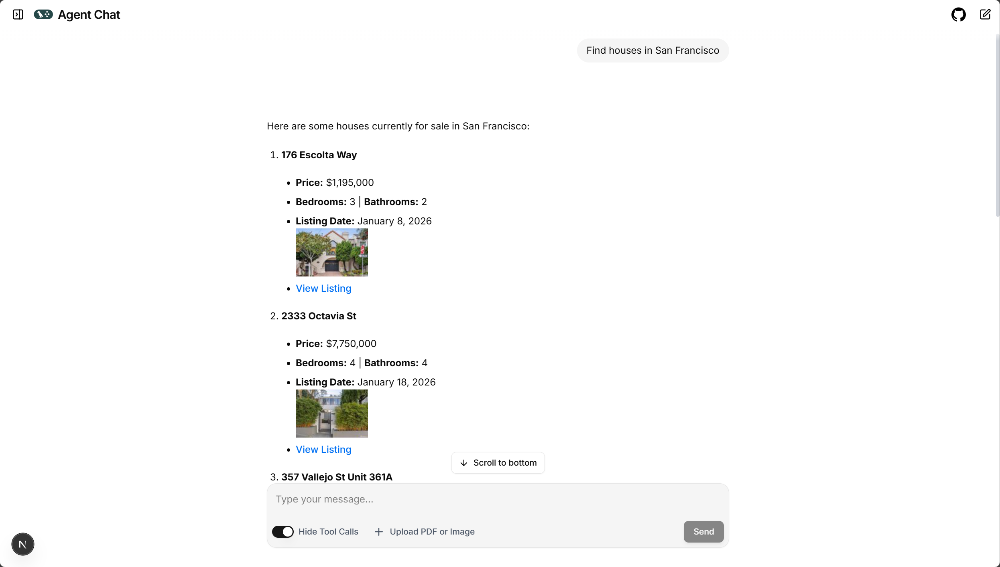
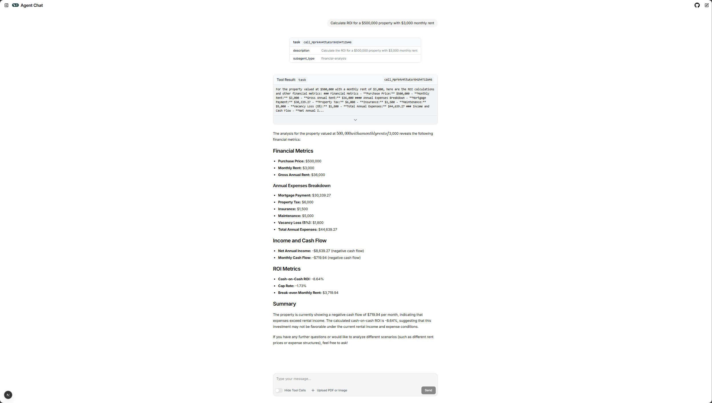
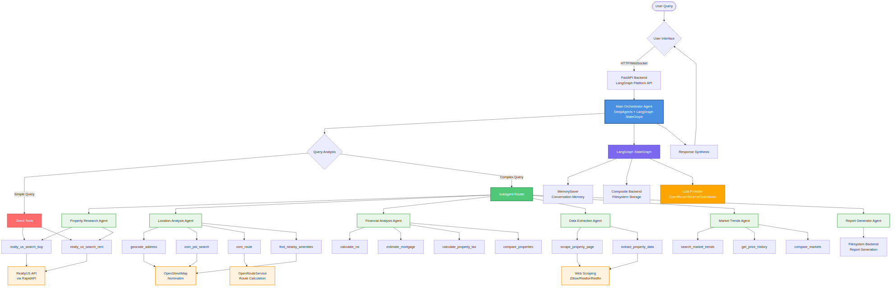
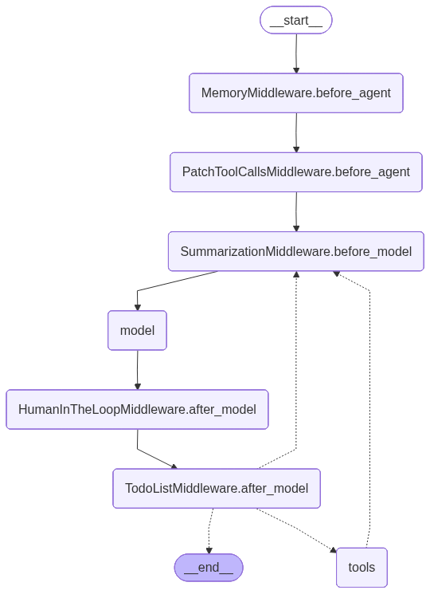

# 🏠 Real Estate AI Deep Agents

<div align="center">

**An enterprise-level real estate AI solution powered by DeepAgents and LangGraph**

[](https://www.python.org/)
[](https://fastapi.tiangolo.com/)
[](https://github.com/langchain-ai/langgraph)
[](https://github.com/deepagents/deepagents)
[](LICENSE)

[Features](#-features) • [Quick Start](#-quick-start) • [Documentation](#-documentation) • [API Reference](#-api-reference)

</div>

<div align="center">
  <table>
    <tr>
      <td align="center">
        
        <p><em>Real Estate AI Deep Agents Chat Interface</em></p>
      </td>
      <td align="center">
        
        <p><em>Financial analysis subagent resolving a complex query</em></p>
      </td>
    </tr>
  </table>
</div>

---

## 📖 Overview

The **Real Estate AI Deep Agents** is a sophisticated, enterprise-grade AI system that helps users search, analyze, and evaluate real estate properties with comprehensive insights. Built on a multi-agent architecture using **DeepAgents** for orchestration and **LangGraph** for state management, it provides intelligent automation for real estate professionals, investors, and homebuyers.

- 🔍 **Intelligent Property Search**: Search properties for sale or rent across the US
- 📊 **Financial Analysis**: ROI calculations, mortgage estimates, property tax analysis
- 📍 **Location Intelligence**: Neighborhood analysis, amenity discovery, route calculation
- 📈 **Market Research**: Trend analysis, price history, market comparisons
- 📄 **Report Generation**: Comprehensive property analysis reports in multiple formats
- 🤖 **Multi-Agent System**: 1 orchestrator + 6 specialized subagents for complex workflows

### Key Highlights

- ✅ **Enterprise-Grade**: Monitoring, caching, rate limiting, error handling, and comprehensive logging
- ✅ **Multi-LLM Support**: OpenRouter (default), Ollama, OpenAI, Groq, Anthropic, Google with automatic fallback
- ✅ **Enterprise Features**: HITL workflows, persistent memory, retry logic, and token management
- ✅ **Modern Stack**: FastAPI, LangGraph, LangChain v1.0+, TypeScript frontend with Next.js
- ✅ **Comprehensive Tools**: 15+ tools for property search, financial analysis, location research, and market trends
- ✅ **Intelligent Delegation**: Smart task routing between direct tools and specialized subagents

---

## 🚀 Features

### Core Capabilities

| Feature | Description |
|---------|-------------|
| **Property Search** | Search properties for sale/rent using RealtyUS API with advanced filtering |
| **Financial Analysis** | Calculate ROI, mortgage payments, property tax, and compare properties |
| **Location Analysis** | Geocode addresses, find nearby amenities, calculate routes, analyze neighborhoods |
| **Market Research** | Research market trends, price history, and compare markets |
| **Data Extraction** | Scrape property pages from Zillow, Realtor.com, Redfin |
| **Report Generation** | Generate comprehensive property analysis reports (Markdown, JSON, HTML) |

### Architecture Features

- **Multi-Agent System**: Intelligent task delegation to specialized subagents
- **Persistent Memory**: Long-term memory for user preferences and property history
- **Hybrid Storage**: Filesystem backend with composite routing for reports and memories
- **Token Management**: Smart token counting and validation to prevent API rate limits
- **Caching**: Redis-based caching for API responses (1-hour TTL)
- **Monitoring**: LangSmith integration for tracing and debugging
- **Rate Limiting**: Per-IP rate limiting for API protection
- **Error Handling**: Graceful error handling with retry logic

---

## 🗺️ Production Roadmap

We're continuously improving the platform to achieve enterprise-grade production readiness. Current focus areas:

| Area | Status | Priority |
|------|--------|----------|
| **Security Hardening** | 🔄 In Progress | Critical |
| **CI/CD Pipeline** | 📋 Planned | Critical |
| **Test Coverage** | 📋 Planned | High |
| **Monitoring & Observability** | 🔄 In Progress | High |
| **Performance Optimization** | 📋 Planned | Medium |
| **Deployment Automation** | 📋 Planned | Medium |

**Key Improvements Coming:**
- 🔐 Secrets management & authentication
- 🚀 Automated CI/CD with GitHub Actions
- ✅ 80%+ test coverage with comprehensive test suite
- 📊 Enhanced monitoring with centralized logging & APM
- ⚡ Async/await optimizations & connection pooling
- 🔄 Blue-green deployment & automated rollbacks

For detailed analysis and implementation plan, see [Production Readiness Report](docs/PRODUCTION_READINESS_REPORT.md).

---

## 🏗️ Architecture

### LangGraph Architecture

The system is built on **LangGraph StateGraph** for state management and agent orchestration. Below are two visualizations:

1. **Complete Architecture** - Shows all subagents, tools, and connections
2. **LangGraph Internal Structure**

<div align="center">
  
  <p><em>Complete System Architecture with All 6 Subagents and Tools</em></p>
  <p><small>💡 To generate this PNG: <code>python backend/scripts/mermaid_to_png.py</code> or use <code>mmdc -i docs/complete_architecture.mmd -o assets/complete_architecture.png</code></small></p>
</div>

#### LangGraph Internal Structure

<div align="center">
  
  <p><em>LangGraph StateGraph Internal Structure</em></p>
</div>

> **Note**: This diagram is generated from the actual LangGraph StateGraph structure. You can visualize the graph programmatically using:
> ```bash
> python backend/scripts/visualize_architecture.py
> ```
> Or use [LangGraph Studio](https://github.com/langchain-ai/langgraph/tree/main/packages/langgraph-studio) for interactive visualization.

### System Overview

The system follows a sophisticated multi-agent architecture with intelligent task delegation:

```
┌─────────────────────────────────────────────────────────────┐
│                    User Interface                             │
│              (agent-chat-ui / Direct API)                    │
└──────────────────────┬──────────────────────────────────────┘
                       │
                       ▼
┌─────────────────────────────────────────────────────────────┐
│              Main Orchestrator Agent                          │
│         (DeepAgents + LangGraph StateGraph)                  │
│                                                               │
│  Direct Tools:                                               │
│  • realty_us_search_buy                                      │
│  • realty_us_search_rent                                    │
│                                                               │
│  Subagent Delegation:                                        │
│  • property-research  • location-analysis                   │
│  • financial-analysis • data-extraction                      │
│  • market-trends      • report-generator                     │
└──────────────────────┬──────────────────────────────────────┘
                       │
        ┌──────────────┼──────────────┐
        │              │              │
        ▼              ▼              ▼
┌──────────────┐ ┌──────────────┐ ┌──────────────┐
│   Subagents  │ │    Tools     │ │   Storage    │
│              │ │              │ │              │
│ • property   │ │ • RealtyUS   │ │ • Filesystem │
│ • location   │ │ • Location   │ │ • Composite  │
│ • financial  │ │ • Financial  │ │ • Memory     │
│ • extraction │ │ • Market     │ │              │
│ • trends     │ │ • Scraping   │ │              │
│ • reports    │ │              │ │              │
└──────────────┘ └──────────────┘ └──────────────┘
```

### Technology Stack

- **Backend Framework**: FastAPI (Python 3.11+)
- **Agent Framework**: DeepAgents (orchestration) + LangGraph (state management)
- **LLM Integration**: LangChain v1.0+ with multi-provider support
- **Storage**: Filesystem backend + Composite routing
- **Caching**: Redis (optional)
- **Frontend**: agent-chat-ui (Next.js, TypeScript)
- **API Gateway**: LangGraph Platform API (via `langgraph dev`)

### How It Works

1. **User Query**: User sends a query via frontend or API
2. **Orchestration**: Main agent analyzes the query and decides:
   - Use direct tools for simple queries (e.g., "Find houses in SF")
   - Delegate to subagents for complex tasks (e.g., "Find, analyze, and calculate ROI")
3. **Execution**: Tools and subagents execute their specialized tasks
4. **Synthesis**: Main agent combines results and provides comprehensive response
5. **Memory**: Results stored in persistent memory for future reference

---

## 🚀 Quick Start

### Prerequisites

- **Python**: 3.11 or 3.12 (Python 3.13 has SQLite compatibility issues)
- **Node.js**: 18+ (for agent-chat-ui frontend)
- **Redis**: Optional, for caching (recommended for production)
- **Ollama**: Optional, for local LLM (no API key needed)

### Installation

1. **Clone the repository**:

```bash
git clone --recurse-submodules https://github.com/oelbourki/real-estate-ai-agent.git
cd real-estate-ai-agent
```

2. **Set up backend**:

```bash
cd backend
python -m venv venv
source venv/bin/activate  # On Windows: venv\Scripts\activate

# Install dependencies
pip install -r requirements.txt
pip install -U "langgraph-cli[inmem]"
```

3. **Configure environment variables**:

```bash
cp .env.example .env
# Edit .env with your API keys (see Configuration section)
```

4. **Initialize memory files**:

```bash
python -c "from backends.memory import initialize_memory_files; initialize_memory_files()"
```

5. **Set up frontend** (if using agent-chat-ui):

```bash
cd ../agent-chat-ui
pnpm install
```

### Running the Application

#### Option 1: LangGraph Dev Server (Recommended)

```bash
# From project root
langgraph dev
```

Server starts on `http://localhost:2024` with LangGraph Platform API endpoints.

#### Option 2: FastAPI Backend

```bash
cd backend
python run.py
```

Server starts on `http://localhost:8000` with FastAPI endpoints.

#### Option 3: Frontend (agent-chat-ui)

```bash
cd agent-chat-ui
pnpm dev
```

Frontend starts on `http://localhost:3000`.

---

## ⚙️ Configuration

### Required Environment Variables

Create `backend/.env` from `backend/.env.example`:

#### 1. LLM Provider (choose at least one)

**OpenRouter (Recommended - Default)**:
```bash
OPENROUTER_API_KEY=sk-or-v1-...
OPENROUTER_MODEL=openai/gpt-4o-mini
OPENROUTER_BASE_URL=https://openrouter.ai/api/v1
```

Get your API key from [OpenRouter](https://openrouter.ai/keys).

**Ollama (Local, No API Key)**:
```bash
# Install: curl -fsSL https://ollama.com/install.sh | sh
# Pull model: ollama pull llama3.2
# Start: ollama serve
OLLAMA_BASE_URL=http://localhost:11434
OLLAMA_MODEL=llama3.2
```

**Other Providers**:
```bash
OPENAI_API_KEY=sk-...
GROQ_API_KEY=gsk_...
ANTHROPIC_API_KEY=sk-ant-...
GOOGLE_API_KEY=...
```

#### 2. Real Estate API

```bash
RAPIDAPI_KEY=your_rapidapi_key_here
```

Get your RapidAPI key from [RapidAPI Hub](https://rapidapi.com/hub) and subscribe to the **Realty-US API**.

### Optional Configuration

- **Redis**: `REDIS_URL=redis://localhost:6379/0` (for caching)
- **LangSmith**: For monitoring and debugging - See [LangSmith Setup Guide](docs/LANGSMITH_SETUP.md)
- **Token Limits**: `ENABLE_TOKEN_LIMITS=true`, `MAX_TOKENS_PER_REQUEST=100000`

See `backend/.env.example` for all available options.

#### Quick LangSmith Setup

1. Sign up at [https://smith.langchain.com/](https://smith.langchain.com/)
2. Get your API key from Settings → API Keys
3. Add to `backend/.env`:
   ```bash
   LANGCHAIN_TRACING_V2=true
   LANGCHAIN_API_KEY=your-api-key-here
   LANGCHAIN_PROJECT=real-estate-ai-agent
   ```
4. See [docs/LANGSMITH_SETUP.md](docs/LANGSMITH_SETUP.md) for detailed instructions

---

## 💡 Usage Examples

### Quick Demo

Try these example queries to see the agent in action:

### Example 1: Simple Property Search

```bash
curl -X POST http://localhost:8000/api/v1/chat \
  -H "Content-Type: application/json" \
  -d '{
    "message": "Find houses in San Francisco, CA under $2M",
    "user_name": "John"
  }'
```

**Response**: List of properties with addresses, prices, beds, baths, photos, and listing URLs.

### Example 2: Complex Analysis

```bash
curl -X POST http://localhost:8000/api/v1/chat \
  -H "Content-Type: application/json" \
  -d '{
    "message": "Find 3 bedroom houses in Austin, TX, analyze their locations, and calculate ROI assuming $3000/month rent",
    "user_name": "Jane"
  }'
```

**Response**: Properties found → Location analysis → ROI calculations → Comprehensive report.

### Example 3: Financial Analysis

```bash
curl -X POST http://localhost:8000/api/v1/chat \
  -H "Content-Type: application/json" \
  -d '{
    "message": "Calculate ROI for a $500k property with $3000/month rent, 20% down, 6.5% interest",
    "user_name": "Bob"
  }'
```

**Response**: Detailed ROI breakdown with cash flow, cap rate, and expense breakdown.

### Example 4: Location Analysis

```bash
curl -X POST http://localhost:8000/api/v1/chat \
  -H "Content-Type: application/json" \
  -d '{
    "message": "What amenities are near 123 Main St, San Francisco, CA?",
    "user_name": "Alice"
  }'
```

**Response**: Nearby schools, restaurants, parks, hospitals, shopping centers, etc.

### Example 5: Comprehensive Property Report

```bash
curl -X POST http://localhost:8000/api/v1/chat \
  -H "Content-Type: application/json" \
  -d '{
    "message": "Generate a comprehensive report for properties in Seattle, WA including market analysis and ROI calculations",
    "user_name": "Sarah"
  }'
```

**Response**: Complete property report with market trends, location analysis, financial projections, and recommendations.

### Using the Frontend (agent-chat-ui)

1. Open `http://localhost:3000`
2. Enter:
   - **Deployment URL**: `http://localhost:2024`
   - **Assistant ID**: `real-estate-agent`
3. Start chatting with the AI agent!

---

## 📚 API Reference

### Main Endpoints

#### Chat Endpoint

```http
POST /api/v1/chat
Content-Type: application/json

{
  "message": "Find houses in San Francisco",
  "user_name": "John",
  "conversation_id": "thread_123"  // Optional
}
```

**Response** (LangGraph format):
```json
{
  "messages": [
    {
      "type": "human",
      "content": "Find houses in San Francisco"
    },
    {
      "type": "ai",
      "content": "I found 8 properties..."
    }
  ],
  "thread_id": "thread_123"
}
```

#### Health Check

```http
GET /health
```

**Response**:
```json
{
  "status": "healthy",
  "version": "1.0.0",
  "redis": "connected",
  "timestamp": 1234567890
}
```

#### Metrics

```http
GET /metrics
```

**Response**: Request counts, error rates, response times, cache performance.

### LangGraph Platform API

When using `langgraph dev`, these endpoints are automatically available:

- `GET /info` - Server information
- `GET /threads/search` - Search threads
- `POST /threads` - Create thread
- `GET /assistants/{assistant_id}/threads/{thread_id}/runs` - Get run history
- `POST /assistants/{assistant_id}/threads/{thread_id}/runs` - Create run
- `POST /assistants/{assistant_id}/threads/{thread_id}/runs/stream` - Stream run

See [docs/](./docs/) for detailed API documentation.

---

## 🛠️ Development

### Project Structure

```
real-estate-ai-agent/
├── backend/                  # Backend Python code
│   ├── agents/              # Agent implementations
│   │   ├── main_agent.py    # Main orchestrator
│   │   └── subagents.py     # Subagent definitions
│   ├── api/                 # FastAPI endpoints
│   │   ├── main.py          # FastAPI app
│   │   └── schemas.py       # Request/response models
│   ├── tools/               # Tool implementations
│   │   ├── realty_us.py     # Property search
│   │   ├── location.py      # Location analysis
│   │   ├── financial.py     # Financial calculations
│   │   ├── market_research.py
│   │   └── web_scraping.py
│   ├── backends/            # Storage backends
│   ├── config/              # Configuration
│   ├── utils/               # Utilities
│   └── tests/               # Test suite
├── agent-chat-ui/           # Frontend (Git submodule)
├── docs/                     # Documentation
├── langgraph.json           # LangGraph configuration
└── README.md                # This file
```

### Running Tests

```bash
cd backend
pytest
```

### Code Quality

```bash
# Format code
black .

# Lint code
ruff check .

# Type checking
mypy .
```

### Adding New Tools

1. Create tool in `backend/tools/`
2. Add to appropriate subagent in `backend/agents/subagents.py`
3. Update documentation

### Adding New Subagents

1. Define subagent in `backend/agents/subagents.py`
2. Create system prompt in `backend/config/subagent_prompts.py`
3. Add tools to subagent definition

---

### API Documentation

- FastAPI docs: `http://localhost:8000/docs` (when running FastAPI backend)
- LangGraph Platform API: See [LangGraph documentation](https://langchain-ai.github.io/langgraph/)

---

## 🤝 Contributing

Contributions are welcome! Please follow these steps:

1. **Fork the repository**
2. **Create a feature branch**:
   ```bash
   git checkout -b feature/amazing-feature
   ```
3. **Make your changes**:
   - Follow PEP 8 style guide
   - Write tests for new features
   - Update documentation
   - Use type hints
4. **Commit your changes**:
   ```bash
   git commit -m 'Add amazing feature'
   ```
5. **Push to the branch**:
   ```bash
   git push origin feature/amazing-feature
   ```
6. **Open a Pull Request**

### Development Guidelines

- **Code Style**: Follow PEP 8, use `black` for formatting
- **Testing**: Write unit tests for new features, aim for >80% coverage
- **Documentation**: Update README and docstrings as needed
- **Type Hints**: Use type hints for all function signatures
- **Commit Messages**: Write clear, descriptive commit messages

---

## 🐛 Troubleshooting

### Common Issues

#### 1. "No LLM provider available"

**Solution**: Configure at least one LLM provider in `backend/.env`:
- Set `OPENROUTER_API_KEY` (recommended)
- Or install and run Ollama locally
- Or set another provider's API key

#### 2. "ModuleNotFoundError: No module named 'config'"

**Solution**: Make sure you're running from the project root or have the backend directory in your Python path. The code uses absolute imports (`from backend.config.settings`).

#### 3. "BlockingError: Blocking call to os.getcwd"

**Solution**: This occurs when using `langgraph dev`. Options:
- Use `langgraph dev --allow-blocking` for development
- Or fix the blocking call in `backend/backends/storage.py` (see [BACKEND_AND_AGENTS_REPORT.md](./BACKEND_AND_AGENTS_REPORT.md))

#### 4. "Request too large" error (Groq)

**Solution**: 
- Use OpenRouter instead (higher limits)
- Or upgrade Groq tier
- Or set `MAX_TOKENS_PER_REQUEST=5500` for Groq free tier

#### 5. Frontend can't connect to backend

**Solution**: 
- Make sure `langgraph dev` is running on `http://localhost:2024`
- Check `agent-chat-ui/.env.local` has correct `NEXT_PUBLIC_API_URL`
- Verify CORS settings in `backend/config/settings.py`

For more troubleshooting, see [docs/](./docs/).

---

## 🔒 Security

The Real Estate AI Agent implements several security measures to protect user data and API keys:

### Security Features

- **Environment Variables**: All sensitive data (API keys, tokens) stored in environment variables
- **Input Validation**: Pydantic models validate all API inputs to prevent injection attacks
- **Rate Limiting**: Per-IP rate limiting prevents abuse and DDoS attacks
- **CORS Protection**: Configurable CORS settings restrict cross-origin requests
- **Error Handling**: Graceful error handling prevents information leakage

### Security Best Practices

1. **Never commit `.env` files** - Always use `.env.example` as a template
2. **Rotate API keys regularly** - Update API keys periodically
3. **Use HTTPS in production** - Always use encrypted connections
4. **Monitor API usage** - Watch for unusual patterns or spikes
5. **Keep dependencies updated** - Regularly update packages for security patches

### Reporting Security Issues

If you discover a security vulnerability, please **do not** open a public issue. Instead, email [otmane.elbourki@gmail.com](mailto:otmane.elbourki@gmail.com) with details.

For detailed security analysis, see [Production Readiness Report](docs/PRODUCTION_READINESS_REPORT.md#2-security-analysis).

---

## ⚠️ Limitations

### Current Limitations

- **Geographic Scope**: Property search limited to US markets only
- **API Dependencies**: Requires external API keys (RapidAPI, LLM providers)
- **Rate Limits**: Subject to rate limits of third-party APIs (RapidAPI, OpenRouter, etc.)
- **Data Freshness**: Property data depends on third-party API updates
- **Python Version**: Requires Python 3.11 or 3.12 (Python 3.13 has compatibility issues)

### Known Constraints

- **Free Tier Limits**: Free tiers of external APIs have usage restrictions
- **Scraping Limitations**: Web scraping subject to target site rate limits and terms of service
- **Memory Storage**: Currently uses filesystem storage (no database for structured data)
- **Single Instance**: Not yet optimized for horizontal scaling

### Future Improvements

We're actively working on addressing these limitations. Key improvements planned:

**Security & Infrastructure:**
- 🔐 Implement secrets management (HashiCorp Vault or AWS Secrets Manager)
- 🔑 Add authentication/authorization (JWT tokens or API keys)
- 🛡️ Add security headers (CSP, HSTS, X-Frame-Options)
- 🔍 Automated dependency vulnerability scanning

**CI/CD & Testing:**
- 🚀 Set up GitHub Actions CI/CD pipeline
- ✅ Increase test coverage to 80%+ (currently ~30%)
- 🧪 Add integration and E2E tests
- 🔧 Add pre-commit hooks for code quality

**Performance & Scalability:**
- ⚡ Fix all blocking operations (async/await optimizations)
- 🔄 Implement HTTP connection pooling
- 📊 Add request queuing (Celery or similar)
- ⚖️ Implement load balancing and auto-scaling

**Monitoring & Observability:**
- 📝 Centralized logging with log aggregation (ELK Stack)
- 📈 APM integration (New Relic, Datadog, or Sentry)
- 📊 Monitoring dashboards (Grafana)
- 🚨 Alerting system (PagerDuty or Opsgenie)

**Deployment & DevOps:**
- 🐳 Automated Docker image building and registry
- 🌍 Staging environment setup
- 🔄 Blue-green deployment strategy
- 📦 Infrastructure as Code (Terraform or CloudFormation)
- 💾 Automated backup strategy

**Database & Storage:**
- 🗄️ Add PostgreSQL for structured data
- 📊 Database connection pooling
- 🔄 Data migration system (Alembic)

---

## 📝 License

This project is licensed under the MIT License - see the [LICENSE](LICENSE) file for details.

---

## 🌟 Star History

If you find this project useful, please consider giving it a ⭐ on GitHub!

---

## 🙏 Acknowledgments

- **[DeepAgents](https://github.com/deepagents/deepagents)** - Agent orchestration framework
- **[LangGraph](https://github.com/langchain-ai/langgraph)** - State management and agent graphs
- **[LangChain](https://github.com/langchain-ai/langchain)** - LLM integration
- **[agent-chat-ui](https://github.com/langchain-ai/agent-chat-ui)** - Frontend chat interface
- **[FastAPI](https://fastapi.tiangolo.com/)** - Modern web framework
- **[Realty-US API](https://rapidapi.com/)** - Property search data

---

## 📧 Contact & Support

- **Author**: Otmane El Bourki
- **Email**: [otmane.elbourki@gmail.com](mailto:otmane.elbourki@gmail.com)
- **Issues**: [GitHub Issues](https://github.com/oelbourki/real-estate-ai-agent/issues)
- **Discussions**: [GitHub Discussions](https://github.com/oelbourki/real-estate-ai-agent/discussions)

---

<div align="center">

**Built with ❤️ using DeepAgents, LangGraph, and FastAPI**

[⭐ Star this repo](https://github.com/oelbourki/real-estate-ai-agent) • [🐛 Report Bug](https://github.com/oelbourki/real-estate-ai-agent/issues) • [💡 Request Feature](https://github.com/oelbourki/real-estate-ai-agent/issues) • [📖 Documentation](./docs/)

---

Made with ❤️ by [Otmane El Bourki](mailto:otmane.elbourki@gmail.com)

</div>
